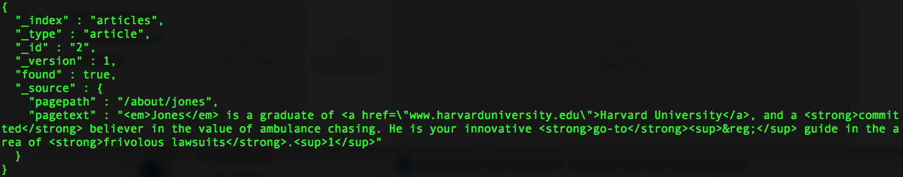

## Add, update, and search

### Document APIs {#document-apis}

Add some data, specifying the id so that the id is human-readable:

``` curl
curl -XPOST 'https://MyPrivateSecurityInfo.us-east-1.bonsaisearch.net/articles/article/1?pretty' -H 'Content-Type: application/json' -d'
{
  "pagepath": "/about",
  "pagetext": "Hershoff, Blatburg, Jones, and Randolf<sup>&reg;</sup>  Attorneys specializing in <strong>ambulance chasing</strong>, are a global, innovation-driven group of <strong>specialists</strong> that develop & market products to improve financial health in more than 75 countries. Call our innovative offices in <ol><li>New York</li><li>Chicago</li><li>San Francisco</li></ol> for more information."
}
'
```

Response:


Fetch the new document; source only, no metadata:

``` curl
curl -XGET 'https://MyPrivateSecurityInfo.us-east-1.bonsaisearch.net/articles/article/1/_source?pretty'
```

Response:


Use a script to update the new document:

``` curl
curl -XPOST 'https://MyPrivateSecurityInfo.us-east-1.bonsaisearch.net/articles/article/1/_update?pretty' -H 'Content-Type: application/json' -d'
{
  "script" : "ctx._source.pagetext += \u0027 Have a nice day!\u0027"
}
'
```

Response:


Fetch the new document, this time including metadata (by default). Note the updated `pagetext` field, and that the version number is 2, not 1, because of the update:

``` curl
curl -XGET 'https://MyPrivateSecurityInfo.us-east-1.bonsaisearch.net/articles/article/1?pretty'
```

Response:


Update using a partial document approach to reset the content back to that of the original document content:

``` curl
curl -XPOST 'https://MyPrivateSecurityInfo.us-east-1.bonsaisearch.net/articles/article/1/_update?pretty' -H 'Content-Type: application/json' -d'
{
    "doc" : {
        "pagetext" : "Hershoff, Blatburg, Jones, and Randolf<sup>&reg;</sup>  Attorneys specializing in <strong>ambulance chasing</strong>, are a global, innovation-driven group of <strong>specialists</strong> that develop & market products to improve financial health in more than 75 countries. Call our innovative offices in <ol><li>New York</li><li>Chicago</li><li>San Francisco</li></ol> for more information."
    }
}
'
```

Response:


Fetch the updated document, and again note the version number (and `pagetext` field) has been updated:

``` curl
curl -XGET 'https://MyPrivateSecurityInfo.us-east-1.bonsaisearch.net/articles/article/1?pretty'
```

Response:


Add another document to the `articles` index using an upsert approach. As we'll soon see, the script only executes on update...

``` curl
curl -XPOST 'https://MyPrivateSecurityInfo.us-east-1.bonsaisearch.net/articles/article/2/_update?pretty' -H 'Content-Type: application/json' -d'
{
    "script" : {
        "source": "ctx._source.pagepath += \u0027/bio\u0027"
    },
    "upsert" : {
        "pagepath": "/about/jones",
        "pagetext": "<em>Jones</em> is a graduate of <a href=\"www.harvarduniversity.edu\">Harvard University</a>, and a <strong>committed</strong> believer in the value of ambulance chasing. He is your innovative <strong>go-to</strong><sup>&reg;</sup> guide in the area of <strong>frivolous lawsuits</strong>.<sup>1</sup>"
    }
}
'
```

Response:


Fetch the new document, noting the pagepath and version:

``` curl
curl -XGET 'https://MyPrivateSecurityInfo.us-east-1.bonsaisearch.net/articles/article/2?pretty'
```

Response:



Resubmit the upsert request, which has been modified to prove that the script - and only the script - is used on update:

``` curl
curl -XPOST 'https://MyPrivateSecurityInfo.us-east-1.bonsaisearch.net/articles/article/2/_update?pretty' -H 'Content-Type: application/json' -d'
{
    "script" : {
        "source": "ctx._source.pagepath += \u0027/bio\u0027"
    },
    "upsert" : {
        "pagepath": "will be ignored",
        "pagetext": "this also will be ignored"
    }
}
'
```

Response:


Fetch the updated document, noting the pagetext (unchanged), and pagepath and version (changed):

``` curl
curl -XGET 'https://MyPrivateSecurityInfo.us-east-1.bonsaisearch.net/articles/article/2?pretty'
```

Response:


Look at all our data using Multi Get:

``` curl
curl -XGET 'https://MyPrivateSecurityInfo.us-east-1.bonsaisearch.net/articles/article/_mget?pretty' -H 'Content-Type: application/json' -d'
{
    "ids": ["1", "2"]
}
'
```

Response:


### Search APIs {#search-apis}

Look at all our data via a simple search using the REST request URI. Note the metadata returned is slightly different than for Multi Get:

``` curl
curl -XGET 'https://MyPrivateSecurityInfo.us-east-1.bonsaisearch.net/articles/_search?pretty' -H 'Content-Type: application/json'
```

Response:


Look at all our data via a simple Match All query using the REST request body. Same results as via the URI, above:

``` curl
curl -XGET 'https://MyPrivateSecurityInfo.us-east-1.bonsaisearch.net/articles/_search?pretty' -H 'Content-Type: application/json' -d'
{
    "query" : {
        "match_all": {}
    }
}
'
```

Response:


Look at all our data w/o including any source at all:

``` curl
curl -XGET 'https://MyPrivateSecurityInfo.us-east-1.bonsaisearch.net/articles/_search?pretty' -H 'Content-Type: application/json' -d'
{
    "query" : {
        "match_all": {}
    },
    "_source" : false
}
'
```

Response:


Look at all our data including only specified source fields, and filtering the metadata to only include the "hits" object. Note that this time version is included in the results:

``` curl
curl -XGET 'https://MyPrivateSecurityInfo.us-east-1.bonsaisearch.net/articles/_search?pretty&filter_path=hits' -H 'Content-Type: application/json' -d'
{
    "version": true,
    "query" : {
        "match_all": {}
    },
    "_source" : ["pagepath"]
}
'
```

Response:


Text Search - Simple. Matches are ORed. Note the relevance scores and custom highlighting in the results:

``` curl
curl -XGET 'https://MyPrivateSecurityInfo.us-east-1.bonsaisearch.net/articles/_search?pretty' -H 'Content-Type: application/json' -d'
{
    "version": true,
    "query" : {
        "match": { "pagetext": "innovative lawsuits ambulance harvard strong" }
    },
    "highlight" : {
        "pre_tags" : ["<match>"],
        "post_tags" : ["</match>"],
        "fields" : {
            "pagetext" : {}
        },
        "fragment_size": 40
    }
}
'
```

Response:


Text Search - Here we override the default sort, which is by relevance score (desc). The scores are now N/A, and therefore not calculated:

``` curl
curl -XGET 'https://MyPrivateSecurityInfo.us-east-1.bonsaisearch.net/articles/_search?pretty' -H 'Content-Type: application/json' -d'
{
    "query" : {
        "match": { "pagetext": "innovative lawsuits ambulance harvard strong" }
    },
    "sort" : {
        "_id": "asc"
    },
    "highlight" : {
        "pre_tags" : ["<match>"],
        "post_tags" : ["</match>"],
        "fields" : {
            "pagetext" : {}
        },
        "fragment_size": 40
    }
}
'
```

Response:


Text Search - Require min number of matches for a result. Only 1 hit this time:

``` curl
curl -XGET 'https://MyPrivateSecurityInfo.us-east-1.bonsaisearch.net/articles/_search?pretty' -H 'Content-Type: application/json' -d'
{
    "query" : {
        "bool": {
            "should": [
                {
                    "term": {
                        "pagetext": "innovative"
                    }
                },
                {
                    "term": {
                        "pagetext": "lawsuits"
                    }
                },
                {
                    "term": {
                        "pagetext": "ambulance"
                    }
                },
                {
                    "term": {
                        "pagetext": "harvard"
                    }
                },
                {
                    "term": {
                        "pagetext": "strong"
                    }
                }
            ],
            "minimum_should_match": 4
        }
    },
    "highlight" : {
        "pre_tags" : ["<match>"],
        "post_tags" : ["</match>"],
        "fields" : {
            "pagetext" : {}
        },
        "fragment_size": 40
    }
}
'
```

Response:


Text Search - Boolean with multiple fields. Only 1 hit, because of the "must_not" clause:

``` curl
curl -XGET 'https://MyPrivateSecurityInfo.us-east-1.bonsaisearch.net/articles/_search?pretty' -H 'Content-Type: application/json' -d'
{
  "query": {
    "bool": {
      "must": [
        { "match": { "pagetext": "jones" } }
      ],
      "must_not": [
        { "match": { "pagepath": "jones" } }
      ]
    }
  }
}
'
```

Response:


Search - Match the entire phrase. Note that there are no matches, though one might expect document #1 to match:

``` curl
curl -XGET 'https://MyPrivateSecurityInfo.us-east-1.bonsaisearch.net/articles/_search?pretty' -H 'Content-Type: application/json' -d'
{
    "query" : {
        "match_phrase": { "pagetext": "innovation driven group of specialists" }
    },
    "highlight" : {
        "pre_tags" : ["<match>"],
        "post_tags" : ["</match>"],
        "fields" : {
            "pagetext" : {}
        },
        "fragment_size": 40
    }
}
'
```

Response:


Next, we will look at Elasticsearch analysis. Among other things, this will explain why there were no matches...
