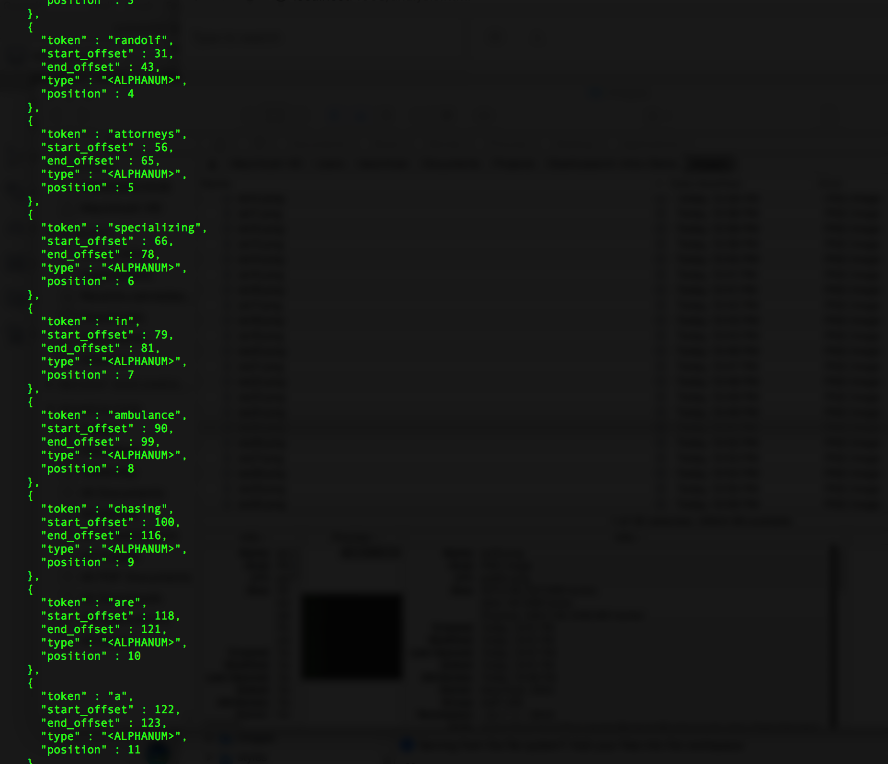

## Analysis I

### Default Analyzer {#default-analyzer}

Analyze the text of document #1, specifying the index, to see it how ES sees it by the "factory default" analyzer. Note, tag names are included:

``` curl
curl -XGET 'https://MyPrivateSecurityInfo.us-east-1.bonsaisearch.net/articles/_analyze?pretty' -H 'Content-Type: application/json' -d'
{
  "text": "Hershoff, Blatburg, Jones, and Randolf<sup>&reg;</sup>  Attorneys specializing in <strong>ambulance chasing</strong>, are a global, innovation-driven group of <strong>specialists</strong> that develop & market products to improve financial health in more than 75 countries. Call our innovative offices in <ol><li>New York</li><li>Chicago</li><li>San Francisco</li></ol> for more information."
}
'
```

Response:


*Note that this is only a portion of the full response.*

Analyze the text of document #1 w/o specifying the index. This is all default analysis behavior, so no need to specify the index at all. Results will be identical to the previous example:

``` curl
curl -XGET 'https://MyPrivateSecurityInfo.us-east-1.bonsaisearch.net/_analyze?pretty' -H 'Content-Type: application/json' -d'
{
  "text": "Hershoff, Blatburg, Jones, and Randolf<sup>&reg;</sup>  Attorneys specializing in <strong>ambulance chasing</strong>, are a global, innovation-driven group of <strong>specialists</strong> that develop & market products to improve financial health in more than 75 countries. Call our innovative offices in <ol><li>New York</li><li>Chicago</li><li>San Francisco</li></ol> for more information."
}
'
```

Analyze the text of document #1 with custom equivalent of the default analyzer. Results will be identical to the previous examples:

``` curl
curl -XGET 'https://MyPrivateSecurityInfo.us-east-1.bonsaisearch.net/_analyze?pretty' -H 'Content-Type: application/json' -d'
{
  "tokenizer" : "standard",
  "filter" : ["standard", "lowercase"],
  "text": "Hershoff, Blatburg, Jones, and Randolf<sup>&reg;</sup>  Attorneys specializing in <strong>ambulance chasing</strong>, are a global, innovation-driven group of <strong>specialists</strong> that develop & market products to improve financial health in more than 75 countries. Call our innovative offices in <ol><li>New York</li><li>Chicago</li><li>San Francisco</li></ol> for more information."}
'
```

Search - match the entire phrase, this time including the HTML tag name to get a match because as we've seen, the analyzer is including tag names:

``` curl
curl -XGET 'https://MyPrivateSecurityInfo.us-east-1.bonsaisearch.net/articles/_search?pretty' -H 'Content-Type: application/json' -d'
{
    "query" : {
        "match_phrase": { "pagetext": "innovation driven group of strong specialists" }
    },
    "highlight" : {
        "pre_tags" : ["<match>"],
        "post_tags" : ["</match>"],
        "fields" : {
            "pagetext" : {}
        },
        "fragment_size": 40
    }
}
'
```

Response:


### Custom Analyzer {#custom-analyzer}

Add a custom analyzer. Note, you first need to close the index to do this:

``` curl
curl -XPOST 'https://MyPrivateSecurityInfo.us-east-1.bonsaisearch.net/articles/_close?pretty'
```

Response:


Create custom analyzer to strip out (or ignore) HTML tags on index `articles`. Make it the default analyzer for the index:

``` curl
curl -XPUT 'https://MyPrivateSecurityInfo.us-east-1.bonsaisearch.net/articles/_settings?pretty' -H 'Content-Type: application/json' -d'
{
    "analysis" : {
        "analyzer" : {
            "default" : {
                "type" : "custom",
                "tokenizer": "standard",
                "char_filter": [
                    "html_strip"
                ],
                "filter": [
                    "standard",
                    "lowercase"
                ]
            }
        }
    }
}
'
```

Response:


Reopen the updated index:

``` curl
curl -XPOST 'https://MyPrivateSecurityInfo.us-east-1.bonsaisearch.net/articles/_open?pretty'
```

Response:


Check the health of the cluster. Sometimes the previous operation will put it in a non-green status:

``` curl
curl -XGET 'https://MyPrivateSecurityInfo.us-east-1.bonsaisearch.net/_cat/health?pretty'
```

Response:


Analyze the text of document #1 w/o specifying the index. This is still default analysis behavior, unchanged by our index update. Results will be identical to the previous analysis examples, above:

``` curl
curl -XGET 'https://MyPrivateSecurityInfo.us-east-1.bonsaisearch.net/_analyze?pretty' -H 'Content-Type: application/json' -d'
{
"text": "Hershoff, Blatburg, Jones, and Randolf<sup>&reg;</sup>  Attorneys specializing in <strong>ambulance chasing</strong>, are a global, innovation-driven group of <strong>specialists</strong> that develop & market products to improve financial health in more than 75 countries. Call our innovative offices in <ol><li>New York</li><li>Chicago</li><li>San Francisco</li></ol> for more information."}
'
```

Analyze the text of document #1, this time specifying the index. Note the removal of the HTML tags in the analysis:

``` curl
curl -XGET 'https://MyPrivateSecurityInfo.us-east-1.bonsaisearch.net/articles/_analyze?pretty' -H 'Content-Type: application/json' -d'
{
"text": "Hershoff, Blatburg, Jones, and Randolf<sup>&reg;</sup>  Attorneys specializing in <strong>ambulance chasing</strong>, are a global, innovation-driven group of <strong>specialists</strong> that develop & market products to improve financial health in more than 75 countries. Call our innovative offices in <ol><li>New York</li><li>Chicago</li><li>San Francisco</li></ol> for more information."}
'
```

Response:



*Note that this is only a portion of the full response.*

Note the documents indexed prior to the analyzer change are found, but "strong" is no longer highlighted because the new analyzer is being used to query:

``` curl
curl -XGET 'https://MyPrivateSecurityInfo.us-east-1.bonsaisearch.net/articles/_search?pretty' -H 'Content-Type: application/json' -d'
{
    "query" : {
        "match": { "pagetext": "innovative lawsuits ambulance harvard strong" }
    },
    "highlight" : {
        "pre_tags" : ["<match>"],
        "post_tags" : ["</match>"],
        "fields" : {
            "pagetext" : {}
        }
    }
}
'
```

Response:


This clearly illustrates the effect of indexing with one analyzer and querying with another. Hits are detected, but highlighting is not working because offsets are misaligned:

``` curl
curl -XGET 'https://MyPrivateSecurityInfo.us-east-1.bonsaisearch.net/articles/_search?pretty' -H 'Content-Type: application/json' -d'
{
    "query" : {
        "match": { "pagetext": "strong" }
    },
    "highlight" : {
        "pre_tags" : ["<match>"],
        "post_tags" : ["</match>"],
        "fields" : {
            "pagetext" : {}
        }
    }
}
'
```

Response:


Update the index using Update by Query. This corrects the analysis inconsistencies:

``` curl
curl -XPOST 'https://MyPrivateSecurityInfo.us-east-1.bonsaisearch.net/articles/_update_by_query?pretty'
```

Response:


Search - Match the entire phrase we used at the end of the last section. This time it works as expected:

``` curl
curl -XGET 'https://MyPrivateSecurityInfo.us-east-1.bonsaisearch.net/articles/_search?pretty' -H 'Content-Type: application/json' -d'
{
    "query" : {
        "match_phrase": { "pagetext": "innovation driven group of specialists" }
    },
    "highlight" : {
        "pre_tags" : ["<match>"],
        "post_tags" : ["</match>"],
        "fields" : {
            "pagetext" : {}
        },
        "fragment_size": 40
    }
}
'
```

Response:


And this time "strong" has been symmetrically excluded from the analysis, and consequently, the search results:

``` curl
curl -XGET 'https://MyPrivateSecurityInfo.us-east-1.bonsaisearch.net/articles/_search?pretty' -H 'Content-Type: application/json' -d'
{
    "query" : {
        "match": { "pagetext": "strong" }
    },
    "highlight" : {
        "pre_tags" : ["<match>"],
        "post_tags" : ["</match>"],
        "fields" : {
            "pagetext" : {}
        }
    }
}
'
```

Response:


The analysis inconsistencies could also have been fixed by updating documents 1 and 2 under the new analyzer using a batch processing approach. The effect is the same; analysis is corrected, document versions are incremented:

``` curl
curl -XPOST 'https://MyPrivateSecurityInfo.us-east-1.bonsaisearch.net/articles/article/_bulk?pretty' -H 'Content-Type: application/json' -d'
{"index":{"_id":"1"}}
{ "pagepath": "/about", "pagetext": "Hershoff, Blatburg, Jones, and Randolf<sup>&reg;</sup>  Attorneys specializing in <strong>ambulance chasing</strong>, are a global, innovation-driven group of <strong>specialists</strong> that develop & market products to improve financial health in more than 75 countries. Call our innovative offices in <ol><li>New York</li><li>Chicago</li><li>San Francisco</li></ol> for more information." }
{"index":{"_id":"2"}}
{ "pagepath": "/about/jones", "pagetext": "<em>Jones</em> is a graduate of <a href=\"www.harvarduniversity.edu\">Harvard University</a>, and a <strong>committed</strong> believer in the value of ambulance chasing. He is your innovative <strong>go-to</strong><sup>&reg;</sup> guide in the area of <strong>frivolous lawsuits</strong>.<super>1</super>" }
'
```

Response:


Now let's get into some more advanced analysis...
