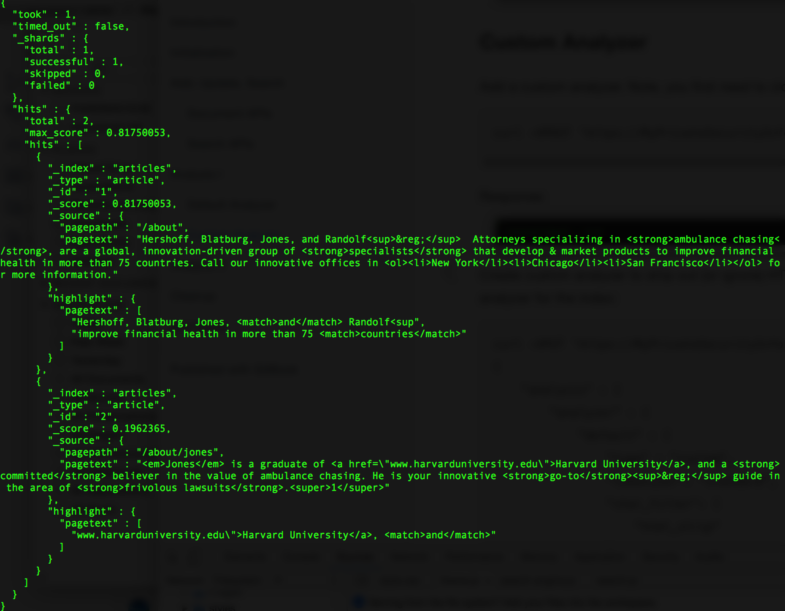
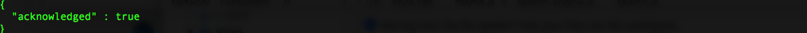
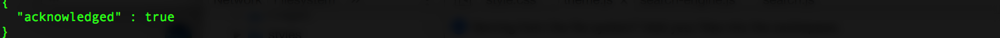
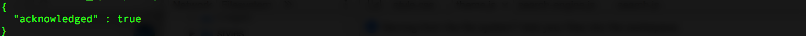
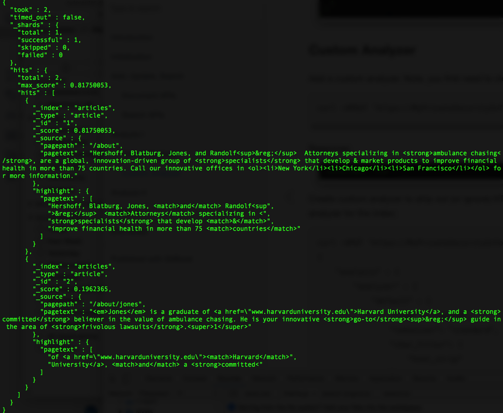

## Analysis II - With char mapping and synonyms

Baseline search, before further customization:

``` curl
curl -XGET 'https://MyPrivateSecurityInfo.us-east-1.bonsaisearch.net/articles/_search?pretty' -H 'Content-Type: application/json' -d'
{
    "query" : {
        "match": { "pagetext": "and countries weasels overpriced" }
    },
    "highlight" : {
        "pre_tags" : ["<match>"],
        "post_tags" : ["</match>"],
        "fields" : {
            "pagetext" : {}
        },
        "fragment_size": 40
    }
}
'
```

Response:



Modify our custom analyzer. Note, you first need to close the index to do this:

``` curl
curl -XPOST 'https://MyPrivateSecurityInfo.us-east-1.bonsaisearch.net/articles/_close?pretty'
```

Response:



Add a custom character mapping filter and custom synonym token filter to our custom analyzer:

``` curl
curl -XPUT 'https://MyPrivateSecurityInfo.us-east-1.bonsaisearch.net/articles/_settings?pretty' -H 'Content-Type: application/json' -d'
{
    "analysis" : {
        "analyzer" : {
            "default" : {
                "type" : "custom",
                "tokenizer": "standard",
                "char_filter": [
                    "html_strip",
                    "and_mapper"
                ],
                "filter": [
                    "standard",
                    "lowercase",
                    "funny_synonym"
                ]
            }
        },
        "char_filter" : {
            "and_mapper": {
                "type": "mapping", 
                "mappings": [
                    "& => and"
                ]
            }
        },
        "filter": {
            "funny_synonym": {
                "type": "synonym",
                "synonyms": [
                    "attorneys => weasels",
                    "harvard => overpriced"
                ]
            }
        }
    }
}
'
```

Response:



Reopen the updated index:

``` curl
curl -XPOST 'https://MyPrivateSecurityInfo.us-east-1.bonsaisearch.net/articles/_open?pretty'
```

Response:



Check the health of the cluster:

``` curl
curl -XGET 'https://MyPrivateSecurityInfo.us-east-1.bonsaisearch.net/_cat/health?pretty'
```

Response:


Revisit the baseline search. Note the effect of the new character and token filters:

``` curl
curl -XGET 'https://MyPrivateSecurityInfo.us-east-1.bonsaisearch.net/articles/_search?pretty' -H 'Content-Type: application/json' -d'
{
    "query" : {
        "match": { "pagetext": "and countries weasels overpriced" }
    },
    "highlight" : {
        "pre_tags" : ["<match>"],
        "post_tags" : ["</match>"],
        "fields" : {
            "pagetext" : {}
        },
        "fragment_size": 40
    }
}
'
```

Response:



Ok, enough fun for now. Now it's time to clean up...
