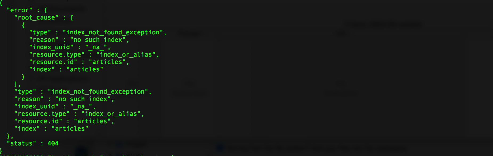
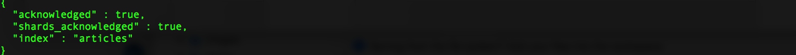
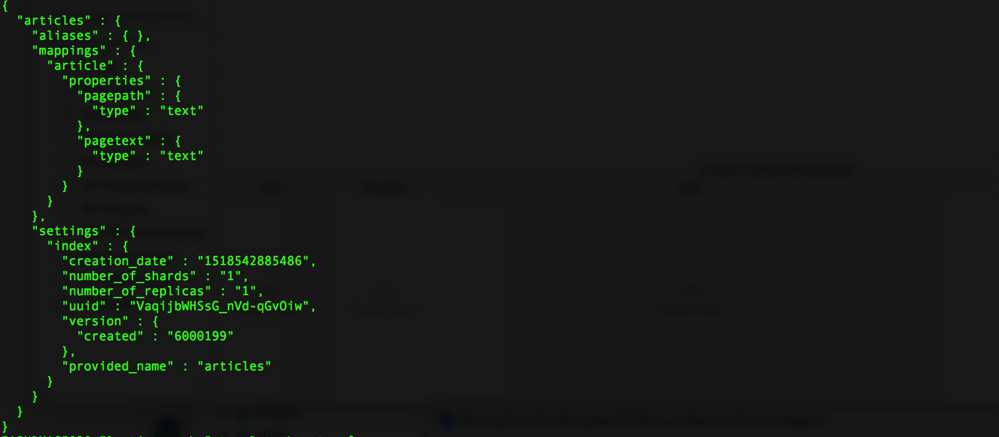
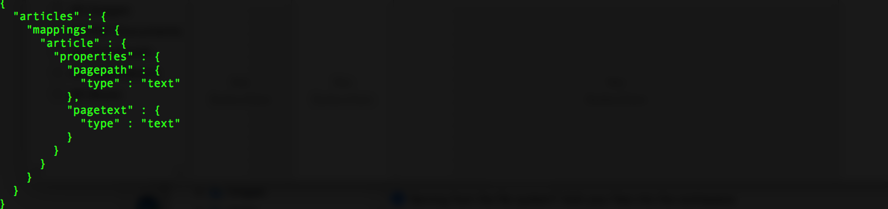

## Initialization

Check for index `articles`:

``` curl
curl -XGET 'https://MyPrivateSecurityInfo.us-east-1.bonsaisearch.net/articles?pretty'
```

Response:



Create index `articles`, with single type mapping (per version 6.0):

``` curl
curl -XPUT 'https://MyPrivateSecurityInfo.us-east-1.bonsaisearch.net/articles?pretty' -H 'Content-Type: application/json' -d'
{
    "mappings" : {
        "article" : {
            "properties" : {
                "pagepath" : { "type" : "text" },
                "pagetext" : { "type" : "text" }
            }
        }
    }
}
'
```

Response:



Use a different verb to check for index `articles`, this time verifying that it does exist:

``` curl
curl -HEAD 'https://MyPrivateSecurityInfo.us-east-1.bonsaisearch.net/articles?pretty'
```

Response:



We can even verify that the `article` type, which was mapped to the `articles` index, exists:

``` curl
curl -HEAD 'https://MyPrivateSecurityInfo.us-east-1.bonsaisearch.net/articles/_mapping/article?pretty'
```

Response:



Next, let's add, update, and fetch some data...
